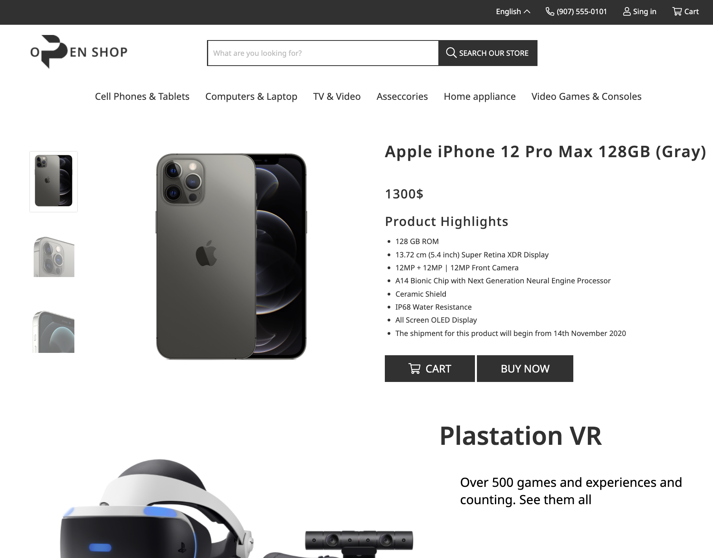

# 📱 Online Phone Market

An online e-commerce website built for selling smartphones and accessories. This project uses **Gulp** as a task runner to automate and streamline development workflows like compiling SCSS, minifying assets, and refreshing the browser with live reload.

---

## 🚀 Features

- 📱 Product listing with images, prices, and specifications
- 🔍 Search and filter functionality
- 🛒 Shopping cart system
- 👤 User registration and login
- 💳 Checkout process
- 📦 Order tracking
- 📱 Mobile-responsive design
- ⚙️ Gulp-powered asset pipeline

---

## 🛠️ Tech Stack

- **Frontend:** HTML5, SCSS, JavaScript (ES6)
- **Task Runner:** [Gulp](https://gulpjs.com/)
- **Backend:** *(Add your backend here if any, e.g., Node.js, Django, Laravel)*
- **Database:** *(Optional: MySQL, MongoDB, etc.)*

---

## ⚙️ Gulp Tasks

| Task         | Description                          |
|--------------|--------------------------------------|
| `gulp`       | Starts development server with live reload |
| `gulp build` | Builds and optimizes all assets      |
| `gulp sass`  | Compiles SCSS to CSS                 |
| `gulp watch` | Watches for file changes             |
| `gulp clean` | Deletes the `dist/` folder           |

---

---

## 📁 Folder Structure

```plaintext
project-root/
│
├── src/
│   ├── html/
│   ├── scss/
│   ├── js/
│   ├── images/
│   └── fonts/
│
├── dist/                # Compiled production files
├── gulpfile.js          # Gulp configuration
├── package.json         # Project metadata and dependencies
└── README.md
```

---

## 🧑‍💻 Getting Started

1. Clone the Repository

```
git clone https://github.com/your-username/online-phone-market.git
cd online-phone-market
```

2. Install Dependencies

```
npm install
```

3. Start Development Server

```
gulp
```

4. Build for Production

```
gulp build
```

---

## 🖼️ Screenshots



---

##🙌 Acknowledgments
	•	Gulp.js
	•	Font Awesome
	•	Unsplash for product images
